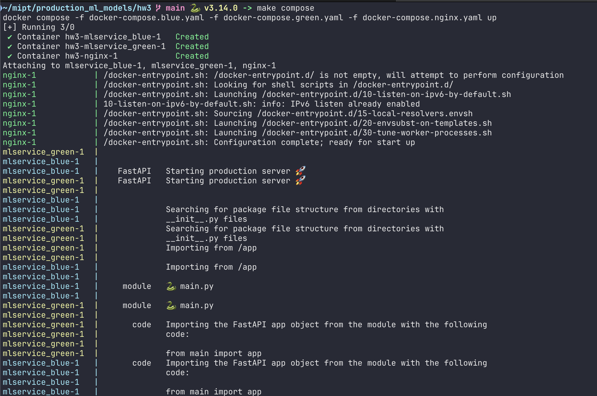
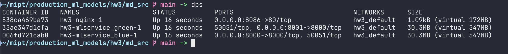
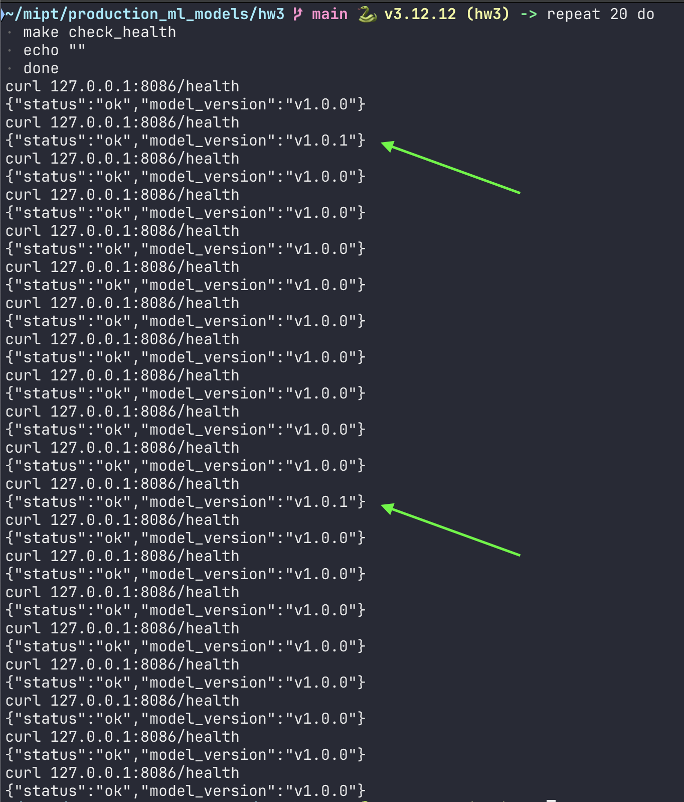
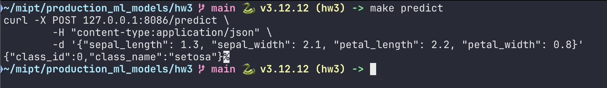
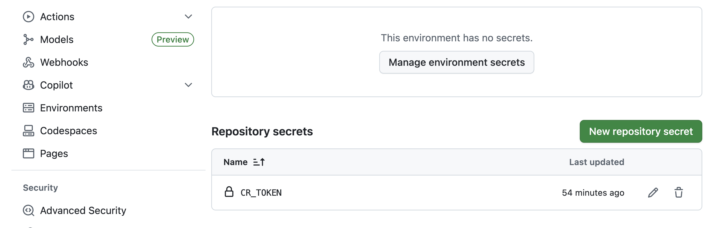
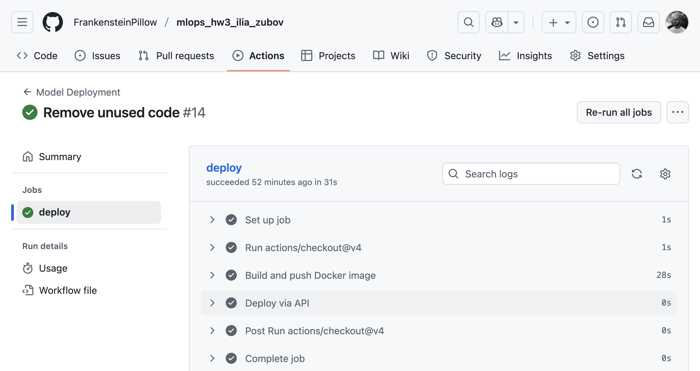

## Цель проекта

Научиться применять стратегии безопасного развертывания (Blue-Green и Canary) для ML-моделей и автоматизировать процесс деплоя через CI/CD (GitHub Actions).

## Сборка и запуск

### UV
Решение использует современный пакетный менеджер python `uv`. Для дальнейшей работы необходима установка только этой системной зависимости. Для его установки необходимо выполнить следующие команды:
* Windows: `powershell -ExecutionPolicy ByPass -c "irm https://astral.sh/uv/install.ps1 | iex"`
* Linux / MacOS: `curl -LsSf https://astral.sh/uv/install.sh | sh`


### Команды make
Для удобства разработки и тестирования я создал несколько `make` команд которые позволяют быстро собирать docker-контейнер, запускать приложение (как в docker так и локально), форматировать код python, а так же осуществлять запросы по двум gRPC эндпоинтам, представленным в сервисе.

Для ознакомления со списком `make` команд можно посмотреть в файл `Makefile`.

### Сборка приложения
Для сборки контейнера с сервисом:
```bash
make build
```
или
```bash
docker build -t hw3 .
```
Для установки зависимостей сервиса локально (не в docker-контейнере):
```bash
uv sync
```

### Запуск приложения
Для запуска контейнера с сервисом:
```bash
make run_docker
```
или
```bash
docker run --name hw3 -p 8000:8000 hw3
```

#### Docker compose
Для того что бы проверить работу blue/green деплоя было разработано три файла с описанием сборки и запуска всех трёх контейнеров:
```
mlservice_blue
mlservice_green
nginx
```

Запустить сборку можно командой:
```bash
make compose
```
или полная команда:
```bash
docker compose -f docker-compose.blue.yaml -f docker-compose.green.yaml -f docker-compose.nginx.yaml up
```

## Blue/Green развёртывание

Я решил реализовать стратегию развертывания **Blue/Green**.
В файле `nginx.conf` указаны веса, которые будут использоваться при маршрутизации запросов к сервису **Blue** (версия 1.0.0)
и к сервису **Green** (версия 1.0.1). Веса указывают на то, что 9 из 10 запросов должны уходить на Blue сервис, все
остальные на Green. Как видно на снимках экрана ниже, эта стратегия реализуется корректно.

## Настройка CI/CD-деплоя через GitHub Actions

Файл, описывающий **GitHub Actions**, расположен в `.github/workflows/deploy.yml`. Я воспользовался шаблоном, который взял
с материалов семинара.

Я описал в своём репозитории secret для хранения container registry токена `RC_TOKEN` и успешно использую его в пайплайне.
Таки образом обеспечивается приватное хранение и использование значения токена, что соответствует стандартам информационной
безопасности.

В ходе пайплайна я успешно делаю `push` в редждистри контейнеров GitHub при каждом новом `push` в main ветку репозитория.

## Снимки экрана с запуском команд и работы пайплайна в GitHub

### Запуск docker compose Blue/Green инсталяции


### Запущенные контейнеры


### Многократный запуск curl на адрес nginx сервера
Для проверки работоспособности Blue/Grean маршрутизации с весами 9 и 1


### Проверка /predict


### Сохранённые secrets для хранения приватных данных


### Пример успешно прошедшего пайплайна в GitHub actions

